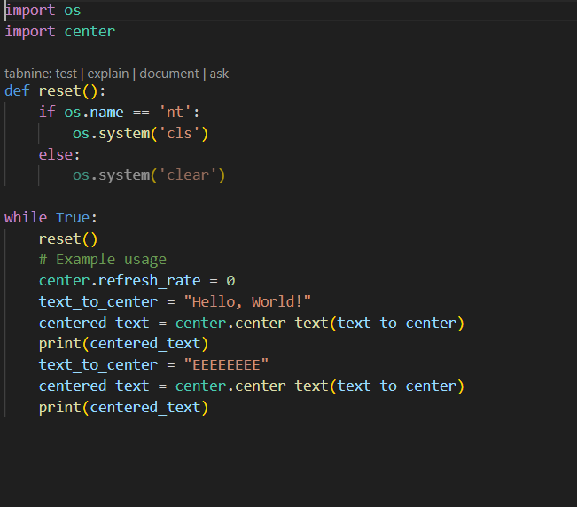

# pycenter
This libre centers text in the terminal just download the python file import it into your file and there is examples on how to use it 

# EXAMPLE ONE

##you store the text you want to center in a variable 
#text_to_center = "Hello, World!" 

##then you make a variable that is going to center the text then do center_text(your variable) 
#centered_text = center.center_text(text_to_center) 

##then print your text and it will center 
#print(centered_text) 

# EXAMPLE TWO
#text_to_center = "I like apples" 
#centered_text = center.center_text(text_to_center) 
#print(centered_text) 

# YOU CAN ALSO CENTER MORE THAN ONE TEXT

#text_to_center = "oh and oranges to" 
#centered_text = center.center_text(text_to_center) 
#print(centered_text) 

# EXAMPLE THREE

##you can also change the refresh rate by doing 
#center.refresh_rate = 5 or whatever value you want and that is how many times 
##the center libre refreshs the terminal so thats why you put everything in a while loop 

